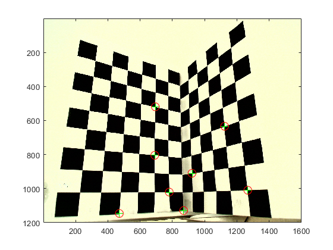

# ETH Computer Vision lecture: small projects

My overall grade: 98.2/100 among all ten projects.

## 1. Calibration 
In this exercise, direct linear transform and Gold standard algorithm are implemented to compute the intrinsic and extrinsic parameters of the camera. The projection error is also introduced and derived.
<!--  -->

- Some key points: 
    - Normalization matrix and we should base on the distance scale (instead of the axis-wise normalization)
    - Using LDT to compute P, and decompose P (do not forget denormalization for computing P)
    - Using QR decomposition to get R and K, using PC = 0 to get the camera position.

## 2. Local Features
In this image, pixel value based local feature detection and matching is implemented.
<!--  -->

- Use kernels to compute image gradient (MATLAB conv will take care of the boundary conditions)
- Patches are used to describe the interesting points, and Harris response function is used to compute the corner point
- Feature Matching is also implemented
    - Single way matching, mutual nearest neighbors, ratio test.

## 3. Particle Filtering
No report required for this lab, one can directly check the code.

## 4. Model Fitting
In this lab we implement the RANSAC and its variant and use it to compute the fundamental matrix.

- RANSAC: randomly select points and pick the best selection (for fundamental matrix computing)
- Adaptive RANSAC: Generally we terminate RANSAC after M trails if we know with a probability p that at least one of the random samples from these M trails is free from outliers: **p=1-(1-r^N)^M**. where r is the largest inlier ratio found so far at every RANSAN iteration. 
    - p is given, we need to terminate when this equation holds based on the changing variable M and r. (N=8 for computing fundamental matrix)
- Epipolar geometry: we need to draw epipolar lines based on the correspondences --> **l'=Fx, l = F^Tx**, if we enforce singularity constraint, then we for sure there will be a non-zero vector which is the eigen-vector for the matrix F. Therefore we can see all epipolar lines intersect exactly.

## 5. Image Segmentation
In this lab we implemented the image segmentation with Mean-shift and Expectation Maximization approaches. 

- Mean Shift: idea is to assign each pixel a mode that it belongs to. The shift happens because the gravity and the center does not coincide and it stops when the center of the area is the average pixel value. (the cluster number is indirectly decided by the radius)
- EM: the idea is to assign each pixel a probability to all possible clusters (therefore we need to predefine the cluster number)
    - EM is iterated until no mean update happens.

## 6. Stereo Matching
In this lab, we implemented stereo matching to compute the disparity matrix for each pixel. We used winner-take-all algorithm and the graph-cut method.

- Winner-take-all: for each pixel, we need to compute a disparity (for each image), this disparity is computed by looking for a value with which the distance function is minimized (SSD in this lab, where distance is computed by taking average over a window around the pixel).
- Graph-cut method: computing the disparity can be formulated as a graph labeling problem. Each pixel corresponds to a graph node and each disparity to a label.
    - Cost term: SSD term (main objective), another term is the cost of assigning labels to neighboring pixels, the idea is to penalize neighboring pixels having different labels (regularization term).
    - In the code, the regularization term is penalized on the gradient of the image.
- One way to automate the process of deciding disparity is to extract features and do feature matching (for example, SIFT feature), and eliminate top 5 percentage and bottom 5 percentage to get a possible disparity range.
- Using two images and all the correspondences, we can do triangulate and reconstruct the 3D scene.

## 7. Structure from Motion
In this lab we wrap all concepts learned before and implement the structure from motion task. 

- We have multiple cameras, the roadmap is as follows:
    - From the first two images from the first two camera, extract features and match them, use RANSAC to compute the fundamental matrix. Then compute the essential matrix by **E = K'FK**. and then compute **P = [R | t]**
    - Based on triangulation, we compute the 3D scenes that image 1 and image 2 have in common. Every time, we only match points those have been triangulated before.
    - Every time a new camera is added, we use RANSAC to find a projection matrix to matches that this new camera has with the triangulated points. Then triangulated new patches.
- Because we assume the first camera as **P = [I | 0]** (in MATLAB, for simplicity, we construct P as a 4x4 matrix), then essential matrix can be written as **E = [t]_x R**, so we can decompose it by SVD.
    - Notice that eigen-value of E are s,s,0, and we can ignore s basically in terms of a coefficient.
    - we have t^TE=0, therefore can solve t directly based on U(3).
- Dealing with calibrated points where K is not necessary anymore.

## 8. Shape Context
In this lab we implemented a shape context descriptor as a feature, and use the Hungarian algorithm to minimize the correspondence cost matrix between two sets of descriptors.

- Shape context descriptor: for each point, we define a log-polar coordinate system with this point as origin, and then count number of points inside each bin. Therefore we can have a distribution of points relative to each points.
- Cost matrix: the dimension of the matrix NxN, where N is the number of points in the set of descriptor. For each set of descriptor, it has dimension NxK, where K is the number of bins for each point.
- Hungarian algorithm is used to solve this combinatorial problem that assign each one from the first set to a unique one from the second set. (like a bipartite problem)

## 9. Condensation Tracker
In this lab we implement a Condensation tracker, which is a recursive Bayesian filter.

- In each iteration, there are few main steps: 
    - Draw N samples from the set with probability distribution; (also serve as resampling!!)
    - Propagate those samples with the model and random noise;
    - Based on the propagated sample, use a bounding box to compute the pixel-based features (histograms), and compute the chi-square distance and update weights for those samples
    - Estimate the mean posterior state.
- Motion model helps occlusion situation
- System noise helps scatter apart the sampled particles and increases the chances of successful tracking.
- Measurement noise decides the shape of the weight distribution, if it is too big, then the distribution is too even and therefore the important particles cannot be recognized.
- Number of bins (for feature computation);
- Update the appearance model or not: if the initial bounding box is not good, we might need to update the model, but updating appearance target might lead to lose track of the actual task --> (in that case should stick to the initial one)

## 10. Image Categorization
In this lab we implemented bag-of-words approach to realize simple image categorization. Images are represented by histograms over visual words,

- Grid points in the image are of interest, for each grid point (feature), we use HoG as a descriptor. (See note for HoG definition);
- Construct the codebook using features from car dataset and non-car dataset, and use kmeans to cluster into k visual words.
- In the testing phase, for each test image, we extract all features and form a histogram distribution, and look into the codebook of car and non-car, if this histogram is more close to the codebook of car, then it is classified as car.
    - simple nearest neighbor classification
    - Bayesian classification: for each visual word, we assume a normal distribution with mean and standard deviation computed from the bags of words. (detail see report)